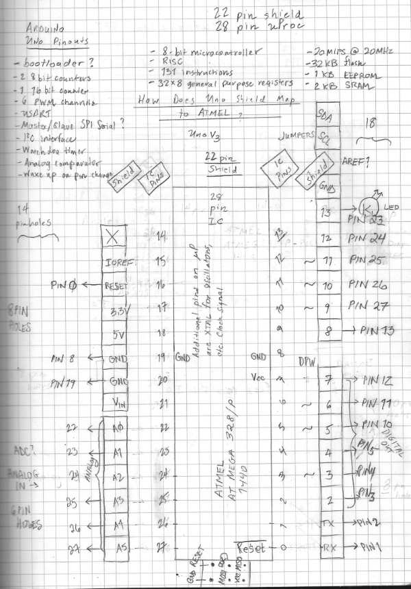

# Arduino Touchscreen
## tft-arduino-mcufriend

TFT for Arduino manufactured/distributed by www.mcufriend.com.

Purchased through Amazon, leveraging 4535 driver chip: 
https://goo.gl/YWbKa9

Modified source code originally developed and found here: 
https://goo.gl/4BMDrJ

This content is no longer available, but I managed to obtain a copy and store it in this repository, along with some of my additions (now and in the future).
All software Copyright by Ceez 2015, unless otherwise stated. A license wasn't originally declared, thus, for now, any work not copyrighted by Ceez is covered under the MIT license for work by me, George Craig. 

Thank you Ceez for your modifications and getting my touchscreen to work with my 16Hz Arduino Uno. My gratitude is in capturing and sharing your work.

### 4535 images

 
 

### Common Problem

 

### Pinouts and Chip Notes

 

